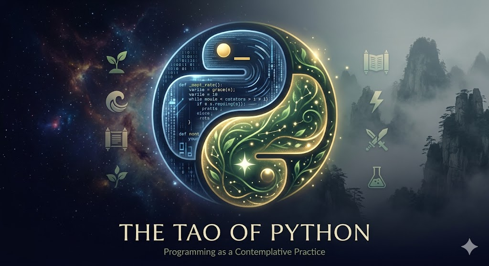
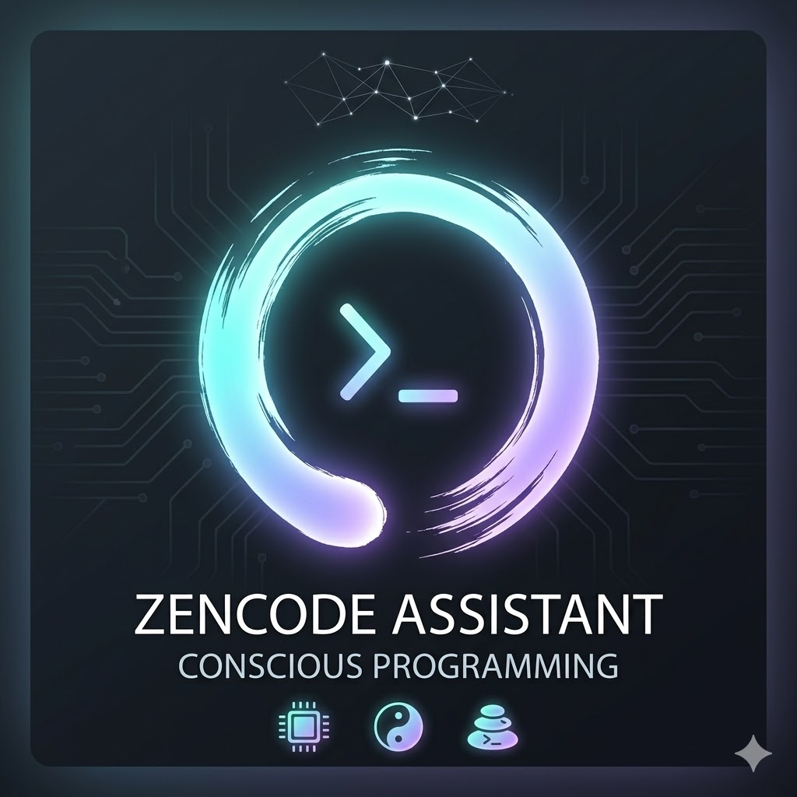

# 🐍 The Tao Of Python

<div align="center">



</div>

> *"In the beginning was the Logos — the Word that creates.*
> *In the beginning of your code was also a word.*
> *`print("Hello, World!")`*
> *And from that word, a universe."*

---

## What Is This?

This is not a tutorial. This is a **path**.

Most Python courses teach you *what* and *how*. This course teaches you **why** — and the why is the gravitational center of all real understanding.

Before you write a single line, you will understand why that line exists. What problem it solves. What truth it reflects. What it reveals about the nature of computation — and about the nature of mind itself.

*The Tao Of Python* is built on a radical premise:

**Programming is a contemplative practice.**

Not a metaphor. Literally. The act of writing clear code — naming things precisely, structuring logic honestly, building systems that hold under pressure — is the same act as training the mind in meditation, or forging a blade in a dojo.

The two serpents of Python's logo do not fight. They dance.
So do logic and spirit, code and consciousness, the algorithm and the soul.

**This is the course where they stop pretending to be separate.**

---

## The Six Phases

| Phase | Chapter | Theme |
|-------|---------|-------|
| 🌱 | [Chapter 1 — The First Steps](chapters/chapter-01-the-first-steps.md) | Variables, types, strings, operators |
| 🌊 | [Chapter 2 — The Many and the One](chapters/chapter-02-the-many-and-the-one.md) | Lists, tuples, sets, dictionaries |
| 📜 | [Chapter 3 — The Word and the Path](chapters/chapter-03-the-word-and-the-path.md) | String manipulation, control flow, loops |
| ⚡ | [Chapter 4 — When Action Learns to Repeat](chapters/chapter-04-when-action-learns-to-repeat.md) | Functions, args/kwargs, scope |
| ⚔️ | [Chapter 5 — The Art of Falling](chapters/chapter-05-the-art-of-falling.md) | Error handling, exceptions, EAFP/LBYL |
| 🔬 | [Chapter 6 — Truth Put to the Test](chapters/chapter-06-truth-put-to-the-test.md) | pytest, assert, parametrize, fixtures |

Each chapter ends with **7 Katas** — executable Python tests you make pass. Not theory. Practice.

---

## How to Begin

### 1. Verify Python 3.11.7

This course was built for Python 3.11.7. Check your version:

```bash
python --version
```

If you need to install it, use [pyenv](https://github.com/pyenv/pyenv):

```bash
pyenv install 3.11.7
pyenv local 3.11.7
```

### 2. Create and Activate the Virtual Environment

A virtual environment is your isolated dojo — clean, controlled, yours.

**On macOS/Linux:**
```bash
python3.11 -m venv .venv
source .venv/bin/activate
```

**On Windows:**
```bash
python -m venv .venv
.venv\Scripts\activate
```

You will know it is active when you see `(.venv)` in your terminal prompt.

### 3. Install Dependencies

```bash
pip install -r requirements.txt
```

### 4. Verify the Setup

```bash
pytest --version
```

If it prints a version number, you are ready.

---

## How to Practice the Katas

The katas live in the `katas/` folder. Each file corresponds to a chapter.

**Run all katas for a chapter:**
```bash
cd katas
pytest chapter_01_katas.py -v
```

**Run all katas across all chapters:**
```bash
cd katas
pytest -v
```

**Run a single specific test:**
```bash
pytest chapter_01_katas.py::test_describe_variable -v
```

### The Kata Protocol

1. Open the kata file. Read the docstring of each function.
2. Implement the function — nothing else. **Do not modify the tests.**
3. Run pytest. See what fails.
4. Fix. Run again. Repeat until all tests pass.
5. Move to the next kata.

A PASSED test is proof. Not belief — **proof.**

```
✅ PASSED chapter_01_katas.py::test_describe_variable[42-int: 42]
✅ PASSED chapter_01_katas.py::test_build_greeting[cosmos-25-...]
✅ PASSED chapter_01_katas.py::test_is_palindrome[racecar-True]
```

When all 7 pass — breathe. Then open the next chapter.

---

## Psssss... Stuck on a Kata?

<div align="center">



</div>

Try using **SpiritualTech's** signature tool — the [ZenCode Assistant](https://spiritualtech777.gumroad.com/l/hbnwd?layout=profile). An AI-powered coding companion built on the ZenCode philosophy. It won't give you the answer — it will help you *find* it.

---

## The Philosophy

This course exists because of a frustration:

Every Python tutorial said *what* to do and *how* to do it. Nobody explained **why it exists.**

- "A list is created with `[]`" — *Why do lists exist?*
- "Use a `for` loop to iterate" — *Why do we need loops?*
- "Define a function with `def`" — *Why are functions fundamental?*

Without the why, you are memorizing syntax. And syntax memorized without understanding is just expensive autocomplete.

**The why is the gravitational center of understanding.** When you know why something exists — what problem it solves, what truth it reflects — the how becomes almost self-evident.

---

## The Three Agreements

Before you open Chapter 1, make three agreements with yourself:

**1. Slow down.** This is not a race. A concept understood deeply is worth more than ten concepts skimmed. The Zen of Python took 30 years to embody. Give each chapter the time it deserves.

**2. Type the code by hand.** Do not copy-paste examples. The act of typing creates different neural pathways than reading. Your hands must learn, not just your mind.

**3. Ask why.** For every concept, before asking "how does this work," ask "why does this exist?" That question is the master key.

---

## A Final Word

The Tao Te Ching says:

> *"A journey of a thousand miles begins with a single step."*

You have already taken it — you are reading this.

The serpents are waiting. They do not fight. They dance.

Join them.

---

<div align="center">

*Built with love.*
*Not as sentiment — as practice.*
*"Everything that I do, I do it with Love."*

**☯️ 🐍 ✨**

</div>

---

## Author

Cosmos De La Cruz & Claude

## Copyright

Copyright (c) 2026 Cosmos De La Cruz. All rights reserved.

Dual-licensed under the [MIT License](LICENSE) and the [Apache License 2.0](LICENSE).

You are free to use, modify, and distribute this work under the terms of either license. See the [LICENSE](LICENSE) file for full details.

## Version

1.1.0
